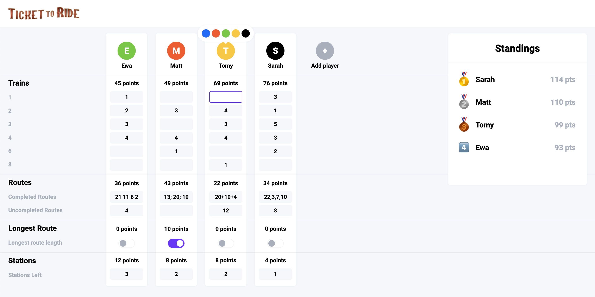

# Ticket to Ride
Ticket to ride is a simple application helping players of the board game "Ticket to Ride Europe" calculate their points and find out the final score.
The rules of score calculating you can find in a game instruction [here](https://www.wydawnictworebel.pl/repository/files/instrukcje/TTR2_europe_rules_PL.pdf).

This app was created to practice JS skills, especially classes. It's working properly on a screen wider than 1050px.

## Technologies
Project is created with JavaScript ES2021, CSS3, HTML5

## How to use

1. Add players using a gray button with plus.
2. Enter players' names and chose the colors of their trains.
3. Enter the number of trains of specific length between two adjacent cities each player accomplished.
4. Enter points from Destination Tickets in the section completed or uncompleted. You can separate numbers with commas, spaces, pluses, or semicolons.
5. Check which player created the longest route.
6. Enter the number of train stations kept in reserve by each player.
7. Viola! The standings box presents the final score of each player and sorts them from winner to loser.

You can do those steps in any order, standings are updated automatically after any change.
